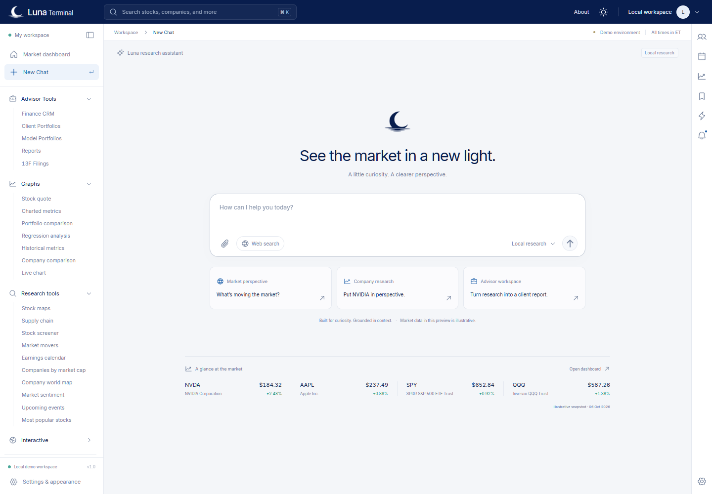
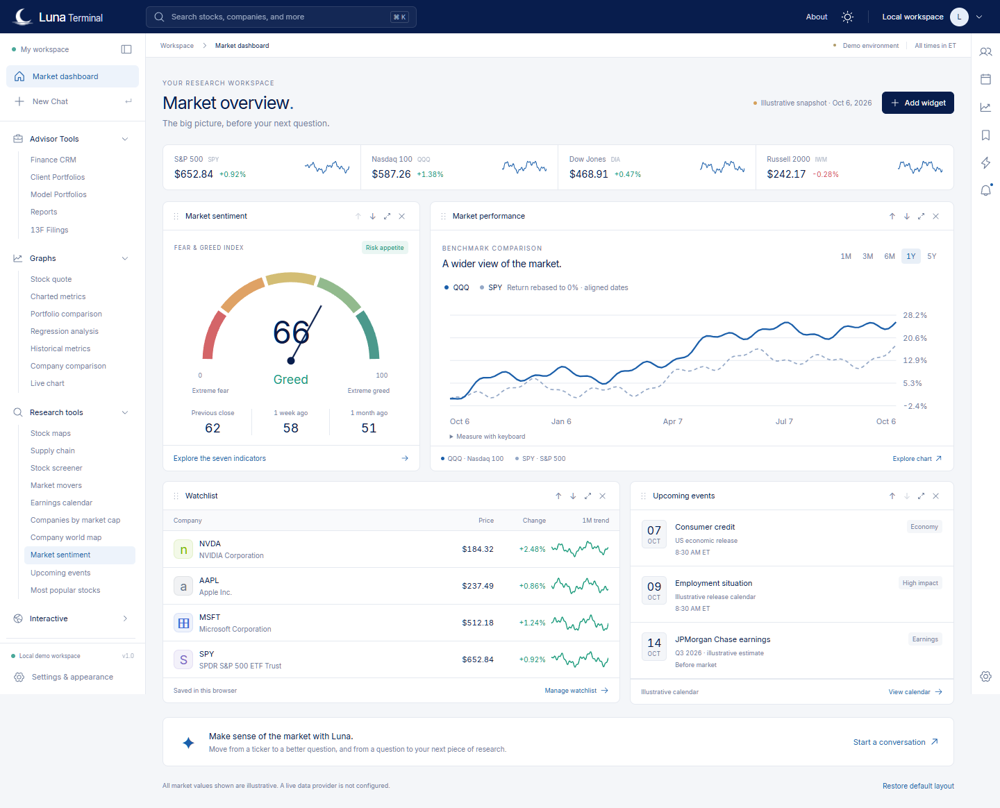

# Luna Terminal

A new JavaScript financial research workspace built with Next.js 16 and React 19. The application is a working local design preview: market research uses clearly labeled illustrative data, advisor work stays in this browser, and the assistant uses deterministic research tools. No hosted model, live market subscription, authentication service, account database or AWS deployment is configured.

## Run locally

Use Node.js 22 or newer. From this directory:

```powershell
npm ci
npm run dev
```

Open http://127.0.0.1:3000. The root redirects to `/about`; the conversation workspace is `/dashboard/chat`. Local preview credentials are not required. `.env.example` contains only optional settings and no keys.

```powershell
npm run lint
npm test
npm run build
npm run start
node scripts/smoke.mjs
```

Run the smoke check while the application server is running. All market fixtures are dated **October 6, 2026** and are fictional; their values must never be presented as current quotes. Supported quote and chart instruments are the 18 symbols in `lib/market.mjs`.

## What is implemented

- A shared terminal shell, light-first appearance system, research navigation, a market dashboard and a focused chat workspace.
- Shared deterministic quote/history/sentiment data and bounded public research APIs. Chat streams incremental NDJSON, returns relevant stock cards and page links, and cites text-document excerpts by filename and chunk.
- Dedicated local research and advisor workflows, with explicit browser storage and unavailable-data states. See [feature status](docs/feature-status.md) for the boundary between local behavior and external integrations.
- An optional, pinned SST/OpenNext web deployment configuration. It has not been applied to an AWS account. The separately tested agent HTTP scaffold is not a deployed AgentCore agent.

Application code, route handlers, financial calculations and the agent scaffold use JavaScript/JSX/ES modules. `open-next.config.ts` and `infra/sst.config.ts` are the small TypeScript tooling exception required for AWS deployment configuration; there is no TypeScript product runtime.

## Documentation

- [Data and API contracts](docs/data-contracts.md)
- [Architecture and account boundaries](docs/architecture.md)
- [Feature status and verification](docs/feature-status.md)
- [Verified local journeys and export examples](docs/verification.md)
- [Optional AWS web deployment](docs/deployment.md)
- [References and reuse](docs/reuse.md)

The implementation is delivered to the user-requested private repository [Darthh/NewTerminalTest](https://github.com/Darthh/NewTerminalTest). AWS remains disconnected.

## Preview





The [demo walkthrough](docs/demo-walkthrough.md) connects market research, chat, advisor portfolios, and report exports. Browser verification uses `npm run test:browser`; readable PDF/CSV samples can be regenerated with `npm run examples`.
