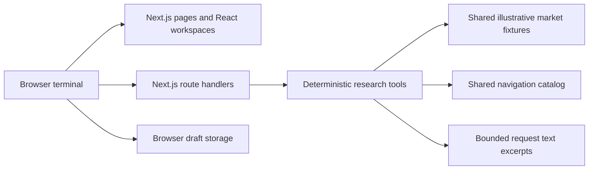

# Architecture

## Current local runtime

The browser and APIs share the same date, quote units, sentiment inputs and financial helpers. There is no user session, server account repository, market-provider subscription or hosted model in this runtime. Browser records belong to this local browser preview. They must not be represented as account-synchronized records.

Ordinary chat is routed through the application server. No direct provider credentials or cloud SDK are shipped to the browser. Text-document contents are evidence, never instructions or account authority. Server validation bounds messages, history, attachments, request body, tool arguments and quotas. Public tools have no private data access.

The `services/agent/server.mjs` entry point is a local contract scaffold with `/ping` and `/invocations`. It runs the same deterministic tools and returns JSON, separate from application NDJSON. It has no AWS credential or service integration. Its Dockerfile specifies a Node.js runtime; the actual ARM64 image has not been built or deployed.

## Optional web-only AWS configuration

`infra/sst.config.ts` defines an OpenNext-managed Next.js web deployment, initially in `us-east-1`. The web path is Browser → CloudFront → Next.js Lambda → shared local tools. Static/cache/revalidation resources are framework-managed, distinct from an application account table. A streaming wrapper is configured; incremental delivery through a deployed distribution remains unverified.

The configuration retains resources, protects the production stage and keeps app identity/region/domain configurable. No AWS request was made while implementing it. It neither creates nor joins an AWS Organization.

## Required future account implementation

Production account features need Auth.js sessions, securely hashed password registration and properly configured optional OAuth. Derive ownership from the validated server session. A caller's `owner`, email or account ID must never establish ownership. Browser-to-account import must be explicit, and account transitions must switch separated caches.

The intended structured record model includes User, unique account WatchlistItem, Alert with previous crossing state, revisioned AdvisorClient and revisioned AdvisorItem (portfolio/report/template). Each write needs owner filtering plus an expected revision, returning conflict on a stale edit. DSQL requires current compatible SQL/Prisma adapters, TLS verification, short-lived IAM tokens and a resumable migration ledger. No Prisma schema, migration runner or DSQL adapter is claimed in this preview.

DynamoDB is the intended account chat repository and shared quota store. Chats need owner-derived partition keys, per-chat/message records, explicit import and delete handling, and atomic TTL counters. Browser chat storage remains a signed-out workspace until this is implemented; the current endpoints return unavailable.

## Required future private research stack

The brief's research pipeline is not provisioned: original storage in private S3, extraction with Bedrock Data Automation, normalized owner-tagged chunks, a matching 1,024-dimensional embedding/index pair, owner-filtered S3 Vectors retrieval, AgentCore synthesis, durable Lambda checkpoints and Athena/Iceberg artifact history. Those components require service/region availability, IAM/model entitlement verification, ownership enforcement, idempotency, retention and recovery tests before an active-state claim.

The current `LUNA_DATA=true` deployment switch fails explicitly rather than provisioning unused stores or suggesting working account features. The larger account/research stacks need reviewed runtime adapters and infrastructure together; a config file alone cannot satisfy persistence or extraction behavior.
